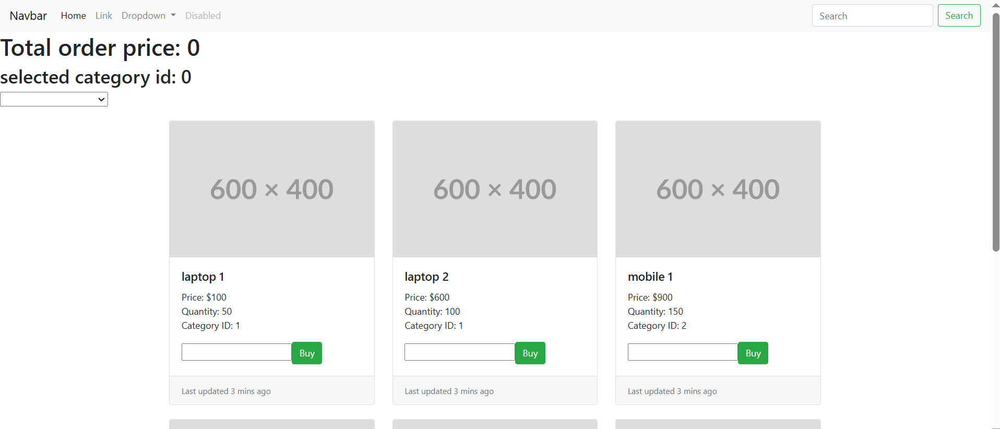

# 🅰️ My First Angular Project – Learning by Practice

Welcome to my first Angular project! 🎉  
In this project, I explored the basics of Angular structure, component creation, data binding, and Bootstrap integration.  
This README documents all the steps and notes I practiced while building this app.

---

## 📁 Project Structure

Inside the `src/app` directory, I created the following:

### ✅ Models

I generated two interfaces to represent my data:

```bash
ng g i IProduct
ng g i ICategory
```

These interfaces live inside a dedicated `/models` folder and help structure the data passed between components.

---

### 🧱 Components

I organized all components under the `/components` folder:

- **Header Component**  

  ```bash
  ng g c Header
  ```

- **Footer Component**  

  ```bash
  ng g c Footer
  ```

- **Products Component**  

  ```bash
  ng g c Products
  ```

Each component has its own HTML, CSS, TypeScript, and spec files.

---

## 🎨 Bootstrap Integration

To enhance the UI, I installed Bootstrap using:

```bash
npm i bootstrap
```

Then added Bootstrap paths to `angular.json` under `"styles"` and `"scripts"`:

```json
"styles": [
  "node_modules/bootstrap/dist/css/bootstrap.min.css",
  "src/styles.css"
],
"scripts": [
  "src/styles.css",
  "node_modules/bootstrap/dist/js/bootstrap.bundle.js"
]
```

---

## ▶️ Running the App

To start the Angular app and open it in the browser:

```bash
ng serve --open
```

---

## 🧩 Displaying Components in App

I cleaned up the default template in `app.component.html` and used custom selectors to render my components:

```html
<app-header></app-header>
<app-products></app-products>
<app-footer></app-footer>
```

> ✅ Make sure each component is declared in `AppModule` (`app.module.ts`) under the `declarations` array, and any required modules are in `imports`.

---

## 🔄 Angular Data Binding

In the `ProductsComponent`, I practiced all four types of Angular bindings:

### 1. **Interpolation (`{{}}`)**

Displays values from the component class to the template:

```html
<h1>{{ productName }}</h1>
```

### 2. **Property Binding (`[property]`)**

Binds a property in the DOM to a value in the component:

```html

```

### 3. **Event Binding (`(event)`)**

Triggers a method in the component when an event occurs:

```html
<button (click)="addToCart(product)">Add to Cart</button>
```

### 4. **Two-Way Binding (`[(ngModel)]`)**

Combines property and event binding for dynamic input/output:

```html
<select [(ngModel)]="selectedCategory">
  <option *ngFor="let category of categories" [value]="category.id">{{ category.name }}</option>
</select>
```

✅ Don’t forget to import `FormsModule` in `app.module.ts` for `ngModel` to work:

```ts
import { FormsModule } from '@angular/forms';

@NgModule({
  imports: [
    FormsModule
  ]
})
export class AppModule { }
```

---

## 📦 Summary of What I Learned

✅ Organizing Angular app with models and components  
✅ Using Angular CLI to generate interfaces and components  
✅ Integrating Bootstrap via `angular.json`  
✅ Rendering custom components in the main app  
✅ Practicing all 4 types of Angular bindings  
✅ Using `ngModel` and `FormsModule` for two-way data binding  

---

## 🚀 Run Locally

Clone the project and run it locally:

```bash
git clone https://github.com/momenelnakeeb/Angular-Practice-.git
cd ecommerceApp
npm install
ng serve --open
```

---

## 📸 Preview


---

## 📚 Technologies Used

- Angular
- Bootstrap
- TypeScript
- HTML/CSS

---

## 📬 Contact

Feel free to reach out or open an issue if you have any questions or suggestions!

---
